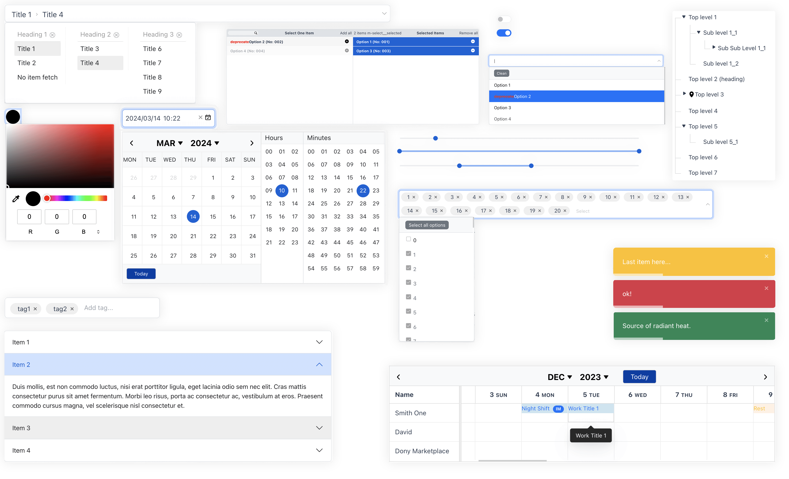

# Funda UI

<p align="center">
  
</p>


React components using pure Bootstrap 5+ which has undergone complex business testing and is easy to integrate with any API. You can load Bootstrap css libraries separately in your project.

All components have undergone complex business verification and provide multiple examples.


<p align="center">
  
</p>


---

- [Documentation](https://uiux.cc/funda-ui-doc)

---


## Key Features

1. Simplify the assignment method of diversified data.
2. Components are compatible with `gRPC`, `REST APIs`, `GraphQL` self-packaging, uniformly use [Classes](https://developer.mozilla.org/en-US/docs/Web/JavaScript/Reference/Classes) and their methods to introduce interfaces
3. Enhanced user interaction, flexible use in asynchronous and synchronous states
4. Introduce appropriate component `.css` files as needed, only for some components with special needs. Most of them can directly use Bootstrap's official style sheet. Styles are performant and easy to override.
5. Do not embed css-in-js, directly use external CSS styles to completely change the component style.


## Components List

Here is a table of the components and their status.


| WEB ELEMENTS | FORMS | INTERACTION | NAVIGATION | LAYOUTS |
| --- | --- | --- | --- | --- |
| [Accordion ✅](packages/Accordion/README.md) | [Input ✅](packages/Input/README.md) | [Infinite Scroll ❏](packages/InfiniteScroll/README.md) |[Multilevel Dropdown Menu ✅](packages/MultilevelDropdownMenu/README.md)  | [MasonryLayout ✅](packages/MasonryLayout/README.md) |
| [Accordion Slider ❏](packages/AccordionSlider/README.md) | [Number Input ✅](packages/NumberInput/README.md) | [Image Perspective Hover ❏](packages/ImagePerspectiveHover/README.md) | [Dropdown Menu ✅](packages/DropdownMenu/README.md)  | [RootPortal ✅](packages/RootPortal/README.md)  |
| [Back To Top ✅](packages/BackToTop/README.md) | [Date ✅🔥](packages/Date/README.md) | [Mousewheel Interaction ❏](packages/MousewheelInteraction/README.md) | | [Splitter Panel  ✅](packages/SplitterPanel/README.md) |
| [Button ❏](packages/Button/README.md) | [Tag Input ✅](packages/TagInput/README.md) | [Parallax ❏](packages/Parallax/README.md) |  |   |
| [Card ❏](packages/Card/README.md) | [Textarea  ✅](packages/Textarea/README.md) | [Scroll Reveal ✅](packages/ScrollReveal/README.md) |  |   |
| [Content Placeholder ❏](packages/ContentPlaceholder/README.md) | [NativeSelect ✅](packages/NativeSelect/README.md) |  [DragDrop List ✅🔥](packages/DragDropList/README.md)  |  |  |
| [Counter ❏](packages/Counter/README.md) | [Cascading Select ✅](packages/CascadingSelect/README.md) | [Mode Switch ✅](packages/ModeSwitch/README.md) |  |  |
| [Hybrid Content Slider ❏](packages/HybridContentSlider/README.md) | [Cascading Select End-to-end ✅🔥](packages/CascadingSelectE2E/README.md) | [Custom Scrollbar ✅](packages/Scrollbar/README.md) |  |  |
| [Image Shapes ❏](packages/ImageShapes/README.md) | [Radio ✅](packages/Radio/README.md) | [Horizontal Scroll Content ✅](packages/HorizontalScrollContent/README.md) |  |  |
| [Lightbox ❏](packages/Lightbox/README.md) | [Checkbox ✅](packages/Checkbox/README.md) | [Refresher ✅](packages/Refresher/README.md) |  |  |
| [List Bulleted ❏](packages/ListBulleted/README.md) | [Select ✅🔥](packages/Select/README.md) |  |  |  |
| [Modal Dialog ✅🔥](packages/ModalDialog/README.md) | [Live Search ✅](packages/LiveSearch/README.md) |  |  |  |
| [Pagination ✅](packages/Pagination/README.md) |  [File ✅](packages/File/README.md) |  |  |  |
| [Table ✅🔥](packages/Table/README.md) | [SearchBar ✅](packages/SearchBar/README.md) |  |  |  |
| [Periodical Scroll ❏](packages/PeriodicalScroll/README.md) | [Switch ✅](packages/Switch/README.md) |  |  |  |
| [Progress Bar ❏](packages/ProgressBar/README.md) | [Dynamic Fields ✅🔥](packages/DynamicFields/README.md) |  |  |  |
| [Rating ❏](packages/Rating/README.md) | [MultipleCheckboxes ✅](packages/MultipleCheckboxes/README.md) |  |  |  |
| [Seamless Scrolling Element ❏](packages/SeamlessScrollingElement/README.md) | [MultipleSelect ✅🔥](packages/MultipleSelect/README.md)  |  |  |  |
| [Show More Less ✅](packages/ShowMoreLess/README.md) | [Range Slider ✅](packages/RangeSlider/README.md) | |  |  |
| [Slideshow ❏](packages/Slideshow/README.md) | [Color Picker ✅](packages/ColorPicker/README.md) |  |  |  |
| [Tabs ✅](packages/Tabs/README.md) |  |  |  |  |
| [Timeline ❏](packages/Timeline/README.md) | |  |  |  |
| [Toast ✅](packages/Toast/README.md) |  |  |  |  |
| [Tooltip ✅](packages/Tooltip/README.md) |  |  |  |  |
| [Digital Clock ✅](packages/DigitalClock/README.md) |  |  |  |  |
| [Tree ✅🔥](packages/Tree/README.md) |  |  |  |  |
| [Event Calendar ✅🔥](packages/EventCalendar/README.md) |  |  |  |  |
| [Event Calendar Timeline ✅🔥](packages/EventCalendarTimeline/README.md) |  |  |  |  |
| [Chatbox ✅🔥🤖](packages/Chatbox/README.md) |  |  |  |  |
| [Stepper ✅](packages/Stepper/README.md) |  |  |  |  |
| [Popover ✅](packages/Popover/README.md) |  |  |  |  |


## Usage

**Step 1**. You need to install it:

```sh
$ npm i funda-ui
```

or

```sh
$ pnpm add funda-ui
```

**Step 2**. Using Bootstrap CSS together (recommended)

[Download bootstrap](https://github.com/twbs/bootstrap)

```html
<link href="./bootstrap.min.css" rel="stylesheet"/>
```

> You could remove Bootstrap's styles. All components support setting Bootstrap's default class names through `**ClassName` attributes.

**Step 3**. import required components as required

> If the component does not have a CSS file, it can not be imported, or use own CSS.


```js
import Input from 'funda-ui/Input';
import Textarea from 'funda-ui/Textarea';
import CascadingSelect from 'funda-ui/CascadingSelect';

// component styles
import 'funda-ui/CascadingSelect/index.css';
```

or 

```js
import { 
    Input,
    Textarea,
    CascadingSelect
} from 'funda-ui';

// component styles
import 'funda-ui/CascadingSelect/index.css';
```

or

```js
const Input = require('funda-ui').Input;
const Textarea = require('funda-ui').Textarea;
const CascadingSelect = require('funda-ui').CascadingSelect;

// component styles
import 'funda-ui/CascadingSelect/index.css';
```


## Collecting Data

### Basic

Use `useState()` to store data.

```js
import React, { useState } from 'react';
import Input from 'funda-ui/Input';
import Select, { OptionConfig, MultiSelectValue } from 'funda-ui/Select';

// component styles
import 'funda-ui/Select/index.css';


interface Config {
    name: string;
    role: boolean;
}


export default () => {
    // Consolidated config state
    const [config, setConfig] = useState<Config>({
        name: '',
        role: '',
    });

    const updateConfig = (newConfig: Partial<Config>) => {
        setConfig(prev => ({ ...prev, ...newConfig }));
    };
    

    const handleSubmit = (e: React.MouseEvent<HTMLButtonElement>) => {
        e.preventDefault();
        alert(`Name: ${config.name}, Role: ${config.role}`);
    };

    return (
        <form onSubmit={handleSubmit}>
            <div>

                <Input
                    name="name"
                    label="Name"
                    onChange={(e: React.MouseEvent, onComposition: any, el: any, value: string) => {
                        updateConfig({ name: value });
                    }}
                />
            </div>

            <div>
        
                <Select
                    label="Role"
                    placeholder="Select"
                    name="role"
                    options={[
                        {"label": "Admin","value": "admin","queryString": ""},
                        {"label": "User","value": "user","queryString": ""}
                    ]}
                    onChange={(e: React.MouseEvent<HTMLElement> | React.KeyboardEvent<HTMLElement>, e2: HTMLElement, val: OptionConfig | MultiSelectValue): void => {
                        updateConfig({ role: (val as OptionConfig).value });
                    }}
                />

            </div>

            <button className="btn btn-outline-primary btn-sm mb-2" type="submit">Submit</button>
        </form>
    );

}
```


### Advanced

Using vanilla JS to collect the value of name is faster and easier.


```js
import React, { useRef } from "react";
import Input from 'funda-ui/Input';
import Select, { OptionConfig, MultiSelectValue } from 'funda-ui/Select';

// component styles
import 'funda-ui/Select/index.css';

// utils
import { serializeArray } from 'funda-ui/Utils/formdata';
import { isEmpty } from "funda-ui/Utils/validate";

interface FormField {
    name: string;
    value: string;
}

interface FormData {
    [key: string]: string;
}

type CallbackFunction = (formData: FormData) => void;
type ErrorCallbackFunction = () => void;

function customValidate(
    form: HTMLFormElement | HTMLDivElement | null,
    callback?: CallbackFunction,
    errCallback?: ErrorCallbackFunction
): void {
    if (form === null) return;

    const formData: FormData = {};
    const fieldsData: FormField[] = serializeArray(form);
    let fieldsCheck: boolean = true;
    let customFieldsCheck: boolean = true;

    // Step 1: everything is ok  
    //-------------
    // required fields
    const emptyFieldsCheck = fieldsData.every((item: FormField) => {
        if (item.name !== null && item.name !== '') {
            formData[item.name] = item.value;

            const _field = form.querySelector<HTMLElement>(`[name="${item.name}"]`);
            if (!_field) return true;

            const fieldRequired = _field.getAttribute('required');
            if (fieldRequired !== null && fieldRequired !== 'false') {
                if (item.value === '' || isEmpty(item.value)) {
                    const _label = _field.dataset.requiredTitle;
                    alert(`${_label} cannot be empty!`);
                    return false;
                }
            }
        }

        errCallback?.();

        return true;
    });

    //  merged result
    fieldsCheck = [emptyFieldsCheck, customFieldsCheck].every((item: boolean) => {
        return item;
    });

    // Step 2: everything is ok  
    //-------------
    if (fieldsCheck) {
        callback?.(formData);
    }
}


export default () => {
    const formRef = useRef<HTMLDivElement>(null);

    const handleSubmit = (e: React.MouseEvent<HTMLButtonElement>) => {
        e.preventDefault();
   
        customValidate(
            formRef.current, 
            (formData: any[]) => {
                alert(JSON.stringify(formData));
            },
            () => { }
        );

    };

    return (
        <div ref={formRef}>
            <div>

                <Input
                    name="name"
                    label="Name"
                />
            </div>

            <div>
        
                <Select
                    label="Role"
                    placeholder="Select"
                    name="role"
                    options={[
                        {"label": "Admin","value": "admin","queryString": ""},
                        {"label": "User","value": "user","queryString": ""}
                    ]}
                />

            </div>

            <button className="btn btn-outline-primary btn-sm mb-2" type="button" onClick={handleSubmit}>Submit</button>
        </div>
    );

}
```


## Getting Started

Make sure if Node 14+ is installed on your computer.

### Step 1: Create a new Lerna workspace by running:

```sh
$ cd /{your_directory}/funda-ui
$ npx lerna init
```


### Step 2: Install dependencies (Required)

It will automatically install the dependencies of all resources in `packages/` without duplication.

```sh
$ npm install
```
 

### Step 3: To open the visualization, run:

```sh
$ npx nx graph
```
 
### Step 4: To build all projects, run

```sh
$ npx lerna run build
```

or Build the package you want (recommend):

```sh
$ npx lerna run build --scope=plugin-1 --scope=plugin-2
```

Please do not install **lerna** globally to use `lerna run build`


### Step 5: (optional) Use a custom script like:

```sh
$ npx lerna exec npm run export --scope=plugin-2
```
  

## Publish the lib of components, it will hang on NPM: 


```sh
$ npm run build:lib
$ npm run build:publish
```
  
  
> **(Optional) Update Utils**
> 
> ```sh
> $ npx lerna run build --scope=funda-utils
> $ npm i
> $ npx lerna run build
> ```
> 


> **(Optional) Manually generate `.d.ts` files, you can execute**
> 
> ```sh
> $ npx -p typescript tsc lib/cjs/*.js --declaration --allowJs --emitDeclarationOnly
> ```
> 


## Contributing

- [Lerna](https://github.com/lerna/lerna)
- [Bootstrap](https://getbootstrap.com/)
- [React](https://react.dev/)


## Inspiration and References

This component library is inspired by several open-source projects such as [react-bootstrap](https://react-bootstrap.netlify.app), [Ant Design](https://ant.design), [MUI](https://mui.com), and [shadcn/ui](https://ui.shadcn.com). It is an open-source plugin library designed as a learning-to-practice project.

The library does **not** contain any personal or company-specific business logic. It serves purely as an auxiliary tool to help efficiently and reliably develop company applications.


## Licensing

Licensed under the [MIT](https://opensource.org/licenses/MIT).

